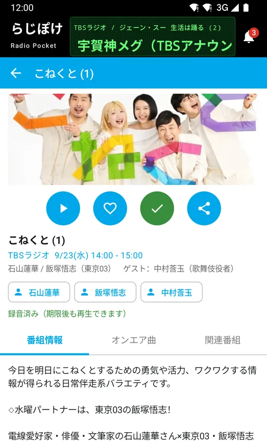

# 聴き逃したラジオ番組を、あとから聴くには

公開: 2026年9月25日 ・ {{ site.developer.name }}

「昨日の夜の番組を聴きそびれた」「好きなゲストが出ていた回を聴き逃した」ということは、よくあります。

このページでは、聴き逃したラジオ番組をあとから聴く方法と、次から聴き逃さないための方法をまとめます。

## 放送が終わった番組を聴く方法

### 聴き逃し配信を使う

放送が終わった番組を、あとからインターネットで聴ける仕組みがあります。

- **radiko の「タイムフリー」** — radiko で配信されている民放の番組などを、放送のあとから聴ける機能です
- **NHK の「らじる★らじる」の聞き逃し** — NHK のラジオ番組のうち、対象の番組をあとから聴けるサービスです

どちらも、聴ける期間には限りがあります。対象になる番組や期間、使える条件は、それぞれのサービスの案内をご確認ください。番組によっては、権利の都合などで配信されないものもあります。

### 番組のポッドキャストを探す

番組によっては、放送の内容やその一部を、公式のポッドキャストとして配信しています。番組名とポッドキャストで検索すると、見つかることがあります。放送と同じ内容とは限らない点にご注意ください。

## 次から聴き逃さないために

聴き逃し配信には期限があります。聴けるうちに聴けないこともあるので、残しておきたい番組は録音しておくと安心です。

- **録音アプリで、端末に残しておく** — 期限を気にせず、好きなときに聴けます
- **毎週の番組は、自動で録音する** — 放送のたびに録っておけば、聴き逃しそのものがなくなります

録音のやり方は [Android でラジオ番組を録音する方法](record-radio-android.html) にまとめています。

## らじぽけで、あとから聴く

らじぽけは、ラジオ番組を聴いたり録音したりできる Android アプリです。基本的な機能は無料で使えます。



{: .shot}

- **番組表で前の日を選ぶ** — 放送が終わった番組を、聴ける範囲であれば、その場で再生・録音できます
- **番組名や出演者で探す** — 「昨日の夜のあの番組」を、検索から見つけられます
- **録音しておけば、期限を気にしなくてよい** — 録音した番組は端末に残り、電波の届かないところでも聴けます
- **好きな番組は自動で録音（プレミアム）** — お気に入りに登録した番組を、放送のたびに録音します

放送局や番組によっては、再生や録音ができないものがあります。

録音した番組は、私的に楽しむ範囲でご利用ください。

[らじぽけを Google Play で見る](https://play.google.com/store/apps/details?id=ca.radipocket&referrer=utm_source%3Dsite%26utm_medium%3Darticle%26utm_campaign%3Dcatch_up)

## まとめ

- 放送が終わってまもない番組は、聴き逃し配信を探す
- 番組によっては、ポッドキャストにもある
- 残しておきたい番組や毎週の番組は、録音しておく

---

らじぽけは個人が開発している非公式のアプリで、radiko・NHK をはじめ、放送局や配信サービスの各社とは関係ありません。各サービスの名称、番組・放送局に関する権利は、それぞれの権利者に帰属します。

[記事の一覧へ](./)
