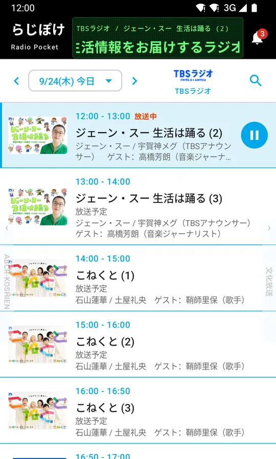
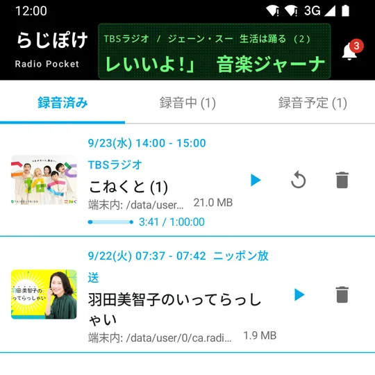

# Android でラジオ番組を録音する方法

公開: 2026年9月25日 ・ {{ site.developer.name }}

聴きたい番組が、いつも聴ける時間に放送されているとは限りません。深夜の番組や、仕事中の昼の番組は、リアルタイムで聴くのが難しいものです。

このページでは、Android のスマートフォンでラジオ番組を録音して、あとから聴くための方法をまとめます。

## 録音のやり方は、大きく3つ

### 1. 録音機能のあるラジオを使う

ラジオの受信機には、番組を録音できるものがあります。電波を直接受けるので、スマートフォンの通信量はかかりません。

ただし、録音したファイルをスマートフォンで聴くには、機器からファイルを移す手間がかかります。電波の入りにくい場所では、音が乱れることもあります。

### 2. 聴き逃し配信を使う（録音ではなく、あとから聴く）

放送局や配信サービスによっては、放送が終わった番組をあとから聴ける仕組みを用意しています。録音しなくても、配信されている期間であれば聴けます。

配信の期間には限りがあり、すべての番組が対象というわけでもありません。期間が過ぎても手元に残しておきたい番組は、録音が向いています。くわしくは [聴き逃したラジオ番組を、あとから聴くには](catch-up-radio.html) にまとめています。

### 3. 録音アプリを使う

スマートフォンのアプリで番組を録音して、端末に保存する方法です。番組表から選んで録音できるので、機器の操作や時刻の設定がいりません。録音したファイルは端末に残るので、電波の届かないところでも聴けます。

## 録音アプリを選ぶときに見ておきたいこと

- **聴きたい放送局が対象か** — 住んでいる地域で聴ける放送局だけが対象、というアプリが多くあります
- **番組を探しやすいか** — 番組表や、番組名・出演者での検索があると、録りたい番組を見つけやすくなります
- **予約や自動録音ができるか** — 毎週の番組を追いかけるなら、放送のたびに自動で録ってくれると手間が減ります
- **保存先を選べるか** — ほかの音楽アプリやパソコンでも聴きたいなら、共有のフォルダに保存できると便利です
- **通信量を抑えられるか** — 録音は通信を使います。Wi-Fi のときだけ録音する設定があると安心です

録音した番組は、私的に楽しむ範囲でご利用ください。

## らじぽけで録音する

らじぽけは、ラジオ番組を録音して端末に残しておくための Android アプリです。基本的な機能は無料で使えます。ここでは、らじぽけでの手順を紹介します。

### 1. 番組表から番組を選ぶ

{: .shot}

放送局と日付を選ぶと、番組が時刻順に並びます。番組名や出演者で検索することもできます。

### 2. 録音する

番組を選んで録音のボタンを押します。放送が終わった番組は、聴ける範囲であればその場で録音できます。

これから放送される番組は、予約しておくと放送のあとに録音されます。お気に入りに登録した番組を、放送のたびに自動で録音することもできます。予約と自動録音は、プレミアムプランの機能です。

### 3. 録音した番組を聴く

{: .shot}

録音した番組は「録音」の一覧に並び、その場から再生できます。聴いていた位置は番組ごとに覚えているので、途中でやめても続きから聴けます。

保存先は、アプリ内・共有の音楽フォルダ・好きなフォルダの3つから選べます。モバイル通信で録音しない設定も、設定の「データ通信の使いかた」から選べます。

手元に置いておける録音の数や、使える機能はプランによって変わります。くわしくは [らじぽけの紹介](../index.html#料金) をご覧ください。

[らじぽけを Google Play で見る](https://play.google.com/store/apps/details?id=ca.radipocket&referrer=utm_source%3Dsite%26utm_medium%3Darticle%26utm_campaign%3Drecord_android)

## まとめ

- 機器で録るなら、録音機能のあるラジオ
- 録音せずにあとから聴くなら、聴き逃し配信
- 番組表から選んで端末に残すなら、録音アプリ

自分の聴き方に合うものを選んでみてください。

---

らじぽけは個人が開発している非公式のアプリで、放送局や配信サービスの各社とは関係ありません。番組・放送局に関する権利は、それぞれの権利者に帰属します。

[記事の一覧へ](./)
