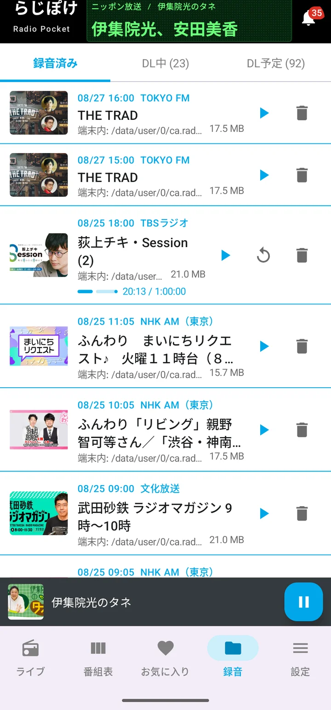
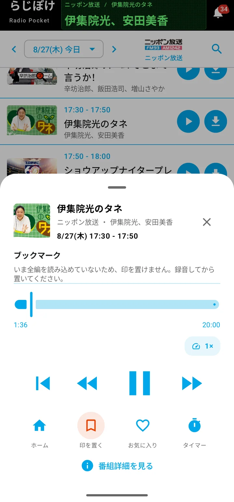
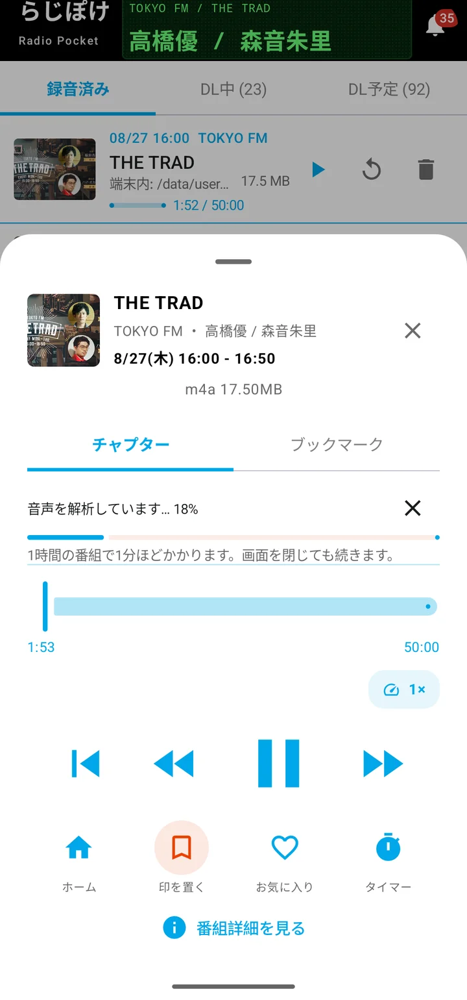

# らじぽけ

Android 向けのラジオ録音アプリです。

radiko で配信されている放送を、いま流れているところからでも、放送が終わったあとからでも聴けます。番組はそのまま端末に録音できるので、電波の届かないところでも、あとから好きなときに聴けます。

**ここまでは無料で使えます。** 番組表・番組の検索・お気に入りの登録・ホーム画面のウィジェット・スリープタイマーも同じです。手元に置いておける録音の数はプランによって変わり、フリープランでは5件までです。

有料プランにすると広告が消え、再生速度とブックマークが使えるようになります。プレミアムプランではさらに、自動録音・頭出し・ラジオで目覚ましが使えます。どれも使い勝手を上げるためのものです。

Android 6.0 以降で動きます。

機能の名前に何も書いていないものは、どのプランでも使えます。うしろに（プレミアム）などと書いてあるものは、そのプラン以上でお使いいただけます。くわしくは [料金](#料金) をご覧ください。

## 聴く

### 今やっている放送を聴く

局を選ぶと、すぐに再生が始まります。再生中は通知やロック画面からも操作できるので、画面を消したまま、家事をしながらでも。

### 番組を探す

1週間ぶんの番組表から番組を選べます。放送が終わった番組（タイムフリー）は、その場で再生することも、録音として端末に残すこともできます。「昨日の夜にやっていた、あの番組」という探し方ができます。

**番組の検索** — 番組名・出演者・番組の説明から探せます。聴きのがした番組を、あとから見つけるのに使えます。

**radiko へのログイン** — radiko のアカウントでログインできます。radiko プレミアム（エリアフリー）に加入していれば、お住まいの地域の外にある放送局も聴けます。ログインしなくても、お住まいの地域の放送局は聴けます。

なお、**radiko プレミアムは radiko 社との契約で、らじぽけの有料プランとは別のものです。** らじぽけがどのプランでも、radiko プレミアムに加入していれば全国の放送局を聴けます。

## 録る

### 自動で録る（プレミアム）

お気に入りに入れた番組は、放送のたびに自動で録音します。毎週の楽しみを録り逃さずに済みます。番組ごとに切り替えられるので、録りたいものだけを録れます。

**キーワードでの自動録音（プレミアム）** — 番組を1つずつ指定するほかに、キーワードを登録しておくこともできます。当てはまる番組が番組表に現れたら、自動で録音を予約します。好きな出演者の名前を入れておく、といった使い方ができます。

**お気に入りの登録そのものは、どのプランでもお使いいただけます。** 自動で録るかどうかが変わるだけです。プランを下げても、登録した予約は消えません。プレミアムに戻すと、そのまま再開します。

**1回だけの録音** — 番組表から、その回だけを録ることもできます。こちらはどのプランでも使えます。

### 録れたものが並ぶ

録音した番組は一覧に並びます。電車や飛行機の中など、電波の届かないところでも聴けます。

**手元に置ける本数は、プランによって変わります。** フリーは5件、スタンダードは10件、プレミアムは無制限です。上限に達すると新しく録れなくなりますが、**すでに録音した音声が消えることはありません。**

保存先は3種類から選べます。

- **アプリ内** — ほかのアプリからは見えません。アプリを削除すると一緒に消えます
- **共有ストレージ** — `Music/RadiPocket` に保存します。ほかの音楽アプリやパソコンからも開けます
- **好きなフォルダ** — 端末の中の好きな場所を指定できます

いずれも「放送局 / 番組名」のフォルダに分けて保存します。

**保存する前に、録音したファイルを検証します。** 変換したあとのファイルを読み直し、音の長さとデータの数が元と合っているかを確かめます。合わなければ、そのことが分かるようにします。録れているつもりで聴けなかった、という事態を避けるためのものです。

**番組情報をファイルに書き込みます。** 番組名・放送局・放送日・番組画像を m4a のタグとして埋め込むので、ほかの音楽アプリで開いても番組ごとにまとまって表示されます。

## あとで聴く

### プレイヤー

少し戻す・少し進める、スリープタイマーといった操作ができます。

**再生速度（スタンダード以上）** — 6段階（0.5 / 1 / 1.5 / 2 / 3 / 5倍）から選べます。移動時間に合わせて長い番組を速く、聞き取りにくいところをゆっくり。よく使う速度を決めておけば、その速度で再生が始まります（ライブは実時間で配信されるため、常に等倍です）。

**聴いていた位置を、番組ごとに覚えています。** 別の番組を聴いてから戻っても、続きから再生できます。

### 頭出しで聴く（プレミアム）

<iframe src="https://www.youtube-nocookie.com/embed/EnfwfwGGKHY" title="らじぽけ機能紹介① 2時間の番組から、聴きたい5分だけ" loading="lazy" referrerpolicy="strict-origin-when-cross-origin" allow="clipboard-write; encrypted-media; picture-in-picture; web-share" allowfullscreen></iframe>

録音した番組の音声を調べ、**無音のところ**（CM の切れ目など）と**オンエア曲の頭**で区切って、章として並べます。聴きたいコーナーから始められます。

プランを下げても、作成済みのチャプターは消えません。プレミアムに戻すと、そのまま表示されます。

**オンエア曲の表示は、どのプランでもお使いいただけます。** 放送中にかかった曲を、曲名と演奏者つきで一覧できます。気に入った曲はお気に入りに残せます。その曲を頭出しの目印として使えるようになるのが、プレミアムです。

### 気になったところに印を置く（スタンダード以上）

録音した番組を聴いていて、あとで聞き返したいところが出てきたら、再生画面の🔖を押してください。**その場で印が残ります。再生は止まりません。**

一覧から選ぶと、その位置から再生が始まります。頭出しが「アプリが見つけた区切り」なのに対して、こちらは**自分で決めた場所**です。同じ画面の隣り合ったタブに並びます。

プランを下げても、置いた印は消えません。件数はそのまま表示され、スタンダードに戻すと中身もそのまま出てきます。

## いつも使う

**ホーム画面のウィジェットが3種類あります。** アプリを開かずに、ホーム画面から操作できます。

- **再生** — いま再生しているものを操作します
- **録音済み** — 録音した番組を並べ、その場から再生します
- **お気に入りの放送局** — よく聴く局を並べ、ひと押しで再生します

**ラジオで目覚まし（プレミアム）** — 指定した時刻に、お気に入りの放送局や録音した番組で起こします。ブザーの音で起きるより、少しだけ機嫌よく起きられます。電波が届かないときは端末のアラーム音に切り替わるので、鳴らない朝がありません。プランを下げても、登録した設定は消えません。プレミアムに戻すと、そのまま鳴り出します。

**スリープタイマー** — 指定した時間がたつと再生を止めます。寝落ちしても、朝までかかりっぱなしになりません。

**クーポンコード** — お渡ししたコードを入力すると、一定の期間だけ上位のプランをお試しいただけます。

## 料金

|  | フリー | スタンダード | プレミアム |
|---|---|---|---|
| 月額 | 0円 | 250円 | 500円 |
| 広告 | あり | なし | なし |
| 録音の保有数 | 5件 | 10件 | 無制限 |
| 再生速度 | 1倍のみ | 6段階 | 6段階 |
| ブックマーク | − | ○ | ○ |
| 自動録音 | − | − | ○ |
| チャプター | − | − | ○ |
| ラジオで目覚まし | − | − | ○ |
| radiko プレミアム連携 | ○ | ○ | ○ |

再生速度の6段階は、0.5 / 1 / 1.5 / 2 / 3 / 5倍です。

**radiko プレミアム（エリアフリー）は radiko 社との契約で、らじぽけの有料プランとは別のものです。** らじぽけがどのプランでも、radiko プレミアムに加入していれば全国の放送局を聴けます。お申し込みと解約は radiko 側のお手続きになります。

上の表にないもの（ライブ再生・タイムフリー再生・番組表・番組の検索・1回だけの録音・保存先3種類・お気に入りの登録・オンエア曲の表示・続きから再生・ホーム画面のウィジェット・スリープタイマー・クーポンコード・録音ファイルへの番組情報の書き込み）は、どのプランでもお使いいただけます。

月額のみで、年間の契約はありません。個人で作っているアプリなので、1年ぶんを先にお預かりするのは荷が重い、というのが正直なところです。使ってみて合わなければいつでも止められる形にしておきたい、という気持ちもあります。

**クローズドテストの期間中は、すべての機能を無料でお使いいただけます。** 有料プランの提供開始時期は未定です。

## クローズドテスト

現在、Google Play でクローズドテストを行っています。**テスターを募集しています。**

参加をご希望の方は、[登録フォーム](https://forms.gle/9D5uzvWPCsjUoy3C7) からお申し込みください。テスターリストへの登録が終わりましたら、こちらからメールでご連絡します。

**テスト期間中は、プレミアムプランの機能をすべて無料でお使いいただけます**（期間が終わるとフリープランに戻ります）。

お申し込みから利用開始までは4段階あります。くわしい手順は [クローズドテストのご案内](test.html) をご覧ください。

## ご注意

らじぽけは、**radiko の公式アプリではありません。** radiko を運営する会社とは関係がなく、個人が開発しているアプリです。radiko の名称、および番組・放送局に関する権利は、それぞれの権利者に帰属します。

録音した番組は、私的に楽しむ範囲でご利用ください。

## お問い合わせ

**らじぽけ開発チーム**

- メール: radiopocket.jp@gmail.com
- X: https://x.com/radiopocketjp
- note: https://note.com/radiopocket

---

[ホーム](index.html) ・ [クローズドテスト](test.html) ・ [プライバシーポリシー](privacy-policy.html) ・ [開発ロードマップ](roadmap.html) ・ [変更履歴](changelog.html)
