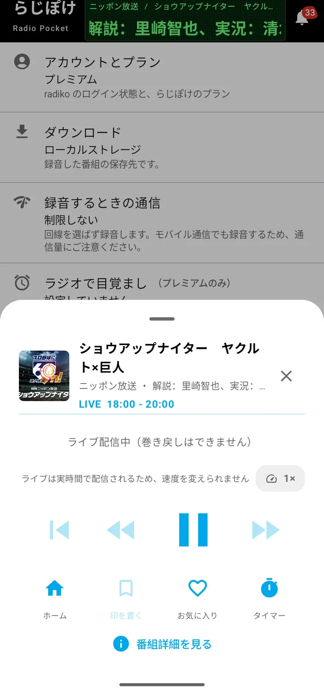
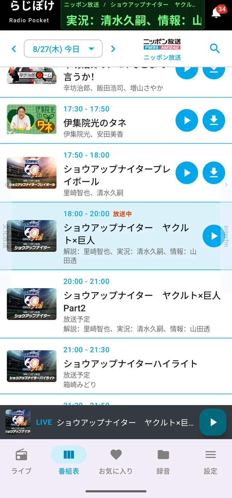

# 聴く

[使い方トップへ](manual.html)

## ライブ再生

「ライブ」タブに、聴ける放送局が並びます。局のカードをタップすると、すぐに再生が始まります。

上のタブで地域を切り替えられます。お住まいの地域は自動で判定されるので、通常は切り替える必要はありません。

再生を始めると、下から再生画面を呼び出せます。

**再生中は通知やロック画面からも操作できます。** 画面を消したまま、家事をしながらでも一時停止・再開ができます。ライブは実時間で配信されるため、巻き戻しや再生速度の変更はできません。

## タイムフリーで聴く

「番組表」タブから、放送が終わった番組を選ぶと再生できます（タイムフリー）。radiko の仕様により、**放送から1週間まで**さかのぼれます。

局を選び、日付を切り替えて、聴きたい番組の再生ボタンを押してください。番組表は左右にスワイプでも日付や局を切り替えられます。

再生を始めると、下から再生画面を呼び出せます。

タイムフリーの再生画面では、上のようにブックマーク（印を置く）に注記が出ることがあります。**全編を読み込めていないタイムフリーには印を置けません。** 印を置きたい場合は、先に録音してください（→ [録る](manual-record.html)）。

再生そのものは全編を読み込んでいなくても始められます。読み込みが追いつくまで、少し先には進めないことがあります。

## 番組を探す

番組表の右上の検索アイコンから、番組名・出演者・番組の説明で検索できます。

「先週やっていた、あの番組」のように、番組名がうろ覚えのときにお使いください。検索結果からもタイムフリー再生・録音ができます。

## 局を並べ替える

番組表の左右スワイプで隣の局に移動する順番は、ライブタブの「並べ替え」（右上の ⇅ アイコン）から変えられます。地域ごとに並びを決められ、一度決めれば以後もその並びが使われます。

**お気に入りの局の並び（[使いこなす](manual-use.html) 参照）とは別のものです。** 混同しやすいので、ここに書いておきます。
