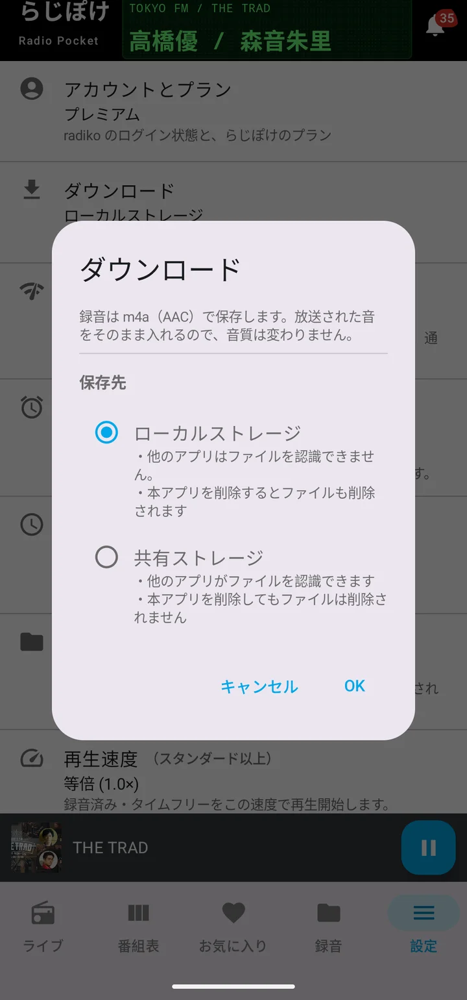
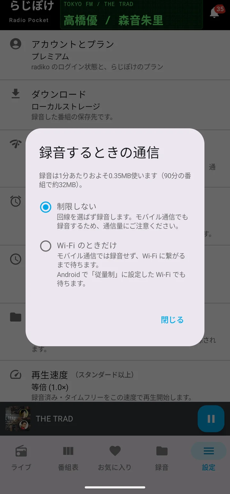

# 録る

[使い方トップへ](manual.html)

## 1回だけ録る

番組表・検索結果に並ぶダウンロードアイコン（⬇）を押すと、その回を録音します。**どのプランでもお使いいただけます。** 放送予定の番組を押すと、放送後に自動でダウンロードされます。

録音の進み方は「録音」タブの「DL中」で確認できます。放送予定のぶんは「DL予定」に並びます。

録音が終わると「録音済み」に移ります。**手元に置ける本数はプランによって変わります**（フリー5件・スタンダード10件・プレミアム無制限）。上限に達すると新しく録れなくなりますが、**すでに録音した音声が消えることはありません。** 上限に達したときは、いくつか削除するか、プランを上げてください。

## 自動で録る（プレミアム）

番組表・検索結果の番組を長押しするか、番組詳細から「お気に入り」に登録すると、放送のたびに自動で録音します。番組ごとに ON / OFF を切り替えられます。

**キーワードでの自動録音（プレミアム）** — お気に入り画面の「キーワード」から、番組名に含まれる言葉を登録できます。当てはまる番組が番組表に現れるたびに、自動で録音を予約します。好きな出演者の名前を登録しておく、といった使い方ができます。「過去の回も録音する」を ON にすると、タイムフリー期限内の放送済みの回もまとめて対象にします。

**お気に入りの登録そのものは、どのプランでもお使いいただけます。** 自動で録るかどうかが変わるだけです。プランを下げても登録は消えず、プレミアムに戻すとそのまま再開します。

同じネット系列の複数の局で同時に流れている番組は、DL予定に1本だけ並びます。局の数だけ重複して予約されることはありません。

**キーワードが広すぎると、予約が大量に増えることがあります。** キーワードを絞る、対象の局を指定する、DL予定から個別に解除する、のいずれかで調整してください。

## 保存先

設定 → ダウンロード から、保存先を選べます。

- **ローカルストレージ** — アプリの中だけに保存します。他のアプリからは見えません。**アプリを削除するとファイルも削除されます。**
- **共有ストレージ** — `Music/RadiPocket` に保存します。他の音楽アプリやパソコンからも開けます。**アプリを削除してもファイルは残ります。**

どちらも「放送局 / 番組名」のフォルダに分けて保存します。**保存先を切り替えても、それまでのファイルは移動しません。** 切り替え前のぶんは元の場所に残ります。

**番組情報をファイルに書き込みます。** 番組名・放送局・放送日・番組画像を m4a のタグとして埋め込むので、他の音楽アプリで開いても番組ごとにまとまって表示されます。

## 録音するときの通信

設定 → 録音するときの通信 から、モバイル通信での録音を避けられます。

「Wi-Fi のときだけ」にすると、モバイル通信の間は録音を待たせ、Wi-Fi に繋がってから録音します。Android で「従量制」に設定した Wi-Fi でも同じように待ちます。自分でダウンロードを押したときは、そのつど「このまま録音する」を選ぶこともできます（このときはデータ量の目安が出ます）。

録音は1分あたりおよそ0.35MBです（90分の番組で約32MB）。
