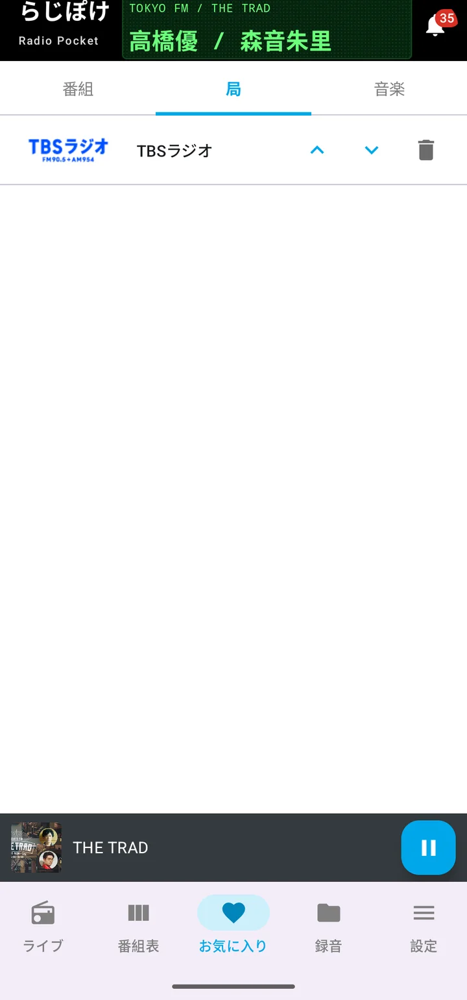
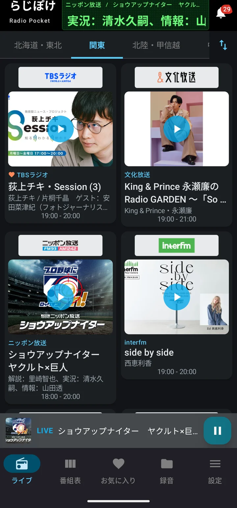
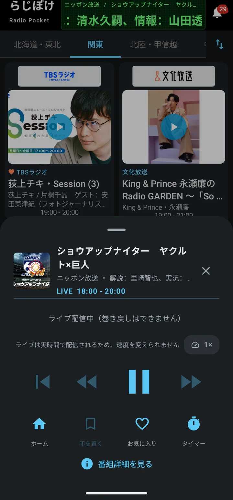
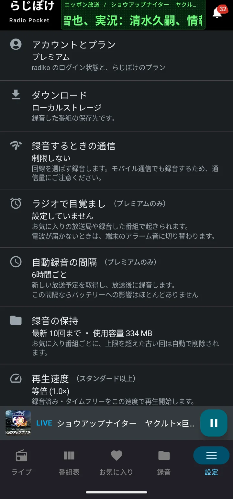

# 使いこなす

[使い方トップへ](manual.html)

## 頭出しで聴く（プレミアム）

録音が終わると、音声を自動で調べて章（チャプター）に区切ります。**無音のところ**（CM の切れ目など）と**オンエア曲の頭**が区切りになります。1時間の番組で1分ほどかかり、その間は再生画面に進み具合が出ます。画面を閉じても解析は続きます。

できあがった章は再生画面の「チャプター」タブに並び、タップするとそこから再生できます。聴きたいコーナーだけを聴く、CM を飛ばして聴く、といった使い方ができます。

**オンエア曲の表示は、どのプランでもお使いいただけます。** 放送中にかかった曲を、曲名と演奏者つきで一覧できます。

気に入った曲は♡でお気に入りに残せます。その曲を頭出しの目印として使えるようになるのがプレミアムです。

プランを下げても、作成済みのチャプターは消えません。プレミアムに戻すと、そのまま表示されます。

## 気になったところに印を置く（スタンダード以上）

再生画面いちばん下の「印を置く」を押すと、いま聴いている位置に印が残ります。**再生は止まりません。** チャプターの隣の「ブックマーク」タブに並び、あとからメモを添えることもできます。

**タイムフリーには置けません。** 全編を読み込めているのは録音済みの音声だけなので、印を置きたい番組は先に録音してください。

一覧から選ぶと、その位置から再生が始まります。設定 → 印から再生する位置 で、印の少し手前（5秒前・10秒前）から再生するようにもできます。押すまでの一呼吸を見込んだ設定です。

プランを下げても、置いた印は消えません。件数はそのまま表示され、スタンダードに戻すと中身もそのまま出てきます。

## お気に入りの局

ライブタブで局のカードを長押しすると、お気に入りに登録されます。お気に入りタブの「局」で確認・並べ替えができます。

**この並びは、番組表の局名を長押ししたときの「デフォルト局」とは別のものです。** デフォルト局は「アプリを開いたときに最初に表示する局」を1つ決めるもので、番組表の局名の長押しから設定します。混同しやすいので、ここに書いておきます。

## ホーム画面のウィジェット

ホーム画面に、アプリを開かずに操作できるウィジェットを置けます。

- **再生** — いま再生しているものを操作します
- **録音済み** — 録音した番組を並べ、その場から再生します
- **お気に入りの放送局** — よく聴く局を並べ、ひと押しで再生します

ホーム画面の空いているところを長押しし、「ウィジェット」から「らじぽけ」を選んでください。

## ラジオで目覚まし（プレミアム）

設定 → ラジオで目覚まし から、時刻とお気に入りの放送局・録音した番組を指定できます。

**電波が届かないときは、端末のアラーム音に切り替わります。** 鳴らない朝がないようにするための仕組みです。

プランを下げても、登録した設定は消えません。プレミアムに戻すと、そのまま鳴り出します。

## スリープタイマー

再生画面の「タイマー」から、指定した時間で再生を止められます。

寝落ちしても、朝までかかりっぱなしになりません。動作中はタイマーの下に残り時間が出ます。

## 再生速度（スタンダード以上）

再生画面の速度表示から、6段階（0.5 / 1 / 1.5 / 2 / 3 / 5倍）を選べます。

移動時間に合わせて長い番組を速く、聞き取りにくいところをゆっくり。設定 → 再生速度 で既定の速度を決めておけば、次からその速度で再生が始まります（ライブは実時間で配信されるため、常に等倍です）。

## 画面の明るさ

設定 → 画面の明るさ から、自動・ダーク・ライトを選べます。**自動は端末のダークモード設定に従います。**

<table><tr>
<td></td>
<td></td>
<td></td>
</tr></table>

夜間や車内で画面がまぶしいと感じるときは、ダークをお選びください。
