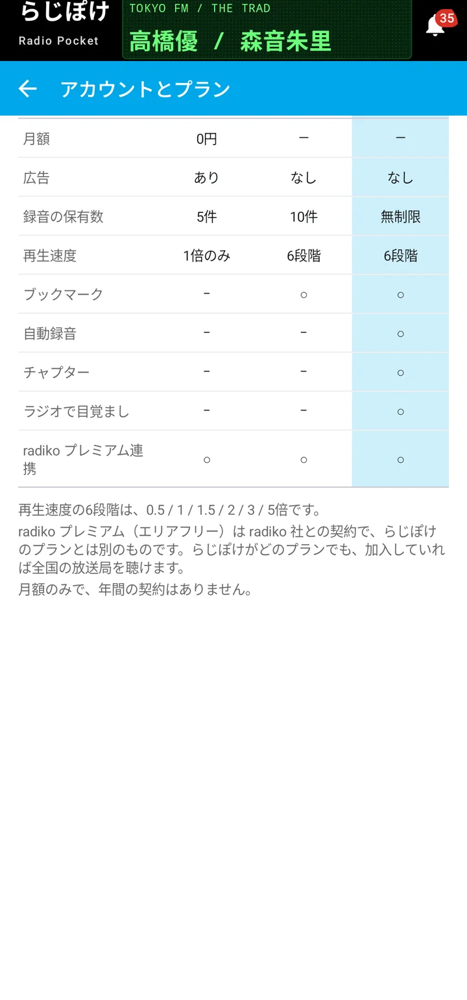
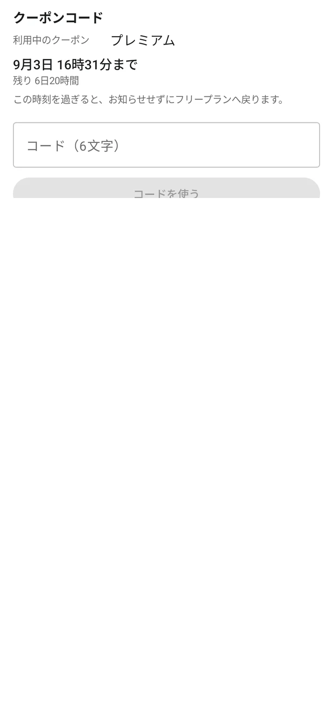

# 使い方

らじぽけの使い方をまとめたページです。5つに分かれています。

- **[はじめに](manual.html)**（このページ）— アカウントとプラン、クーポンコード
- **[聴く](manual-listen.html)** — ライブ再生・タイムフリー・番組表・検索
- **[録る](manual-record.html)** — 録音・自動録音・保存先・通信量
- **[使いこなす](manual-use.html)** — チャプター・ブックマーク・お気に入り・ウィジェット・目覚まし・画面の明るさ
- **[困ったとき](manual-faq.html)** — うまくいかないときの逆引き

読みたいところだけ開いていただいて構いません。上から順に読む必要はありません。

## radiko のアカウントとらじぽけのプラン

らじぽけには、性質の違う2つの契約があります。

**radiko のアカウント** — 放送を聴くための、radiko と利用者の間の契約です。設定 → アカウントとプラン → 「radiko にログイン」から、お使いの radiko アカウントでログインできます。ログインしなくても、お住まいの地域の放送局は聴けます。ログインし、radiko プレミアム（エリアフリー）に加入していれば、お住まいの地域の外にある放送局も聴けます。

**らじぽけのプラン** — このアプリの機能に関する契約です。フリー・スタンダード・プレミアムの3段階があり、設定 → アカウントとプラン から比較できます。

| | フリー | スタンダード | プレミアム |
|---|---|---|---|
| 月額 | 0円 | 250円 | 500円 |
| 広告 | あり | なし | なし |
| 録音の保有数 | 5件 | 10件 | 無制限 |
| 再生速度 | 1倍のみ | 6段階 | 6段階 |
| ブックマーク | − | ○ | ○ |
| 自動録音 | − | − | ○ |
| チャプター | − | − | ○ |
| ラジオで目覚まし | − | − | ○ |
| radiko プレミアム連携 | ○ | ○ | ○ |

**この2つは別の契約です。** らじぽけがどのプランでも、radiko プレミアムに加入していれば全国の放送局を聴けます。逆に、らじぽけをプレミアムにしても、radiko プレミアムに入っていなければエリアフリーにはなりません。

プランを上げるのは Google Play の定期購入です。設定 → アカウントとプラン → 「プランを上げる」から選べます。解約も Google Play 側の操作で行います。**アプリを削除しても定期購入は解約されません。**

**プランを下げても、それまでに作ったもの（お気に入り・チャプター・ブックマーク・目覚ましの設定）は消えません。** 表示や利用が止まるだけで、プランを戻せばそのまま使えます。

## クーポンコード

お渡ししたコードをお持ちの場合は、設定 → アカウントとプラン の下のほうにある「クーポンコード」から入力できます。

6文字のコードを入力して「コードを使う」を押すと、一定の期間だけ上位のプランになります。期限が来ると、**お知らせせずにフリープランへ戻ります。** いつまで有効かは、この画面でいつでも確認できます。
